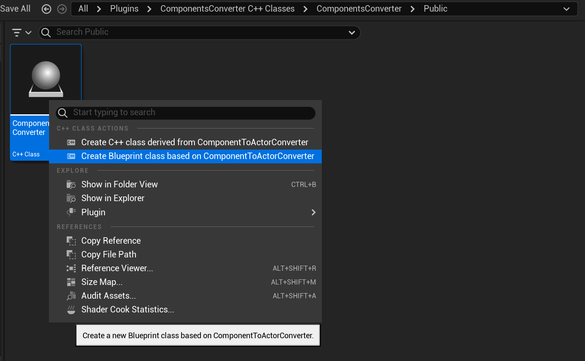
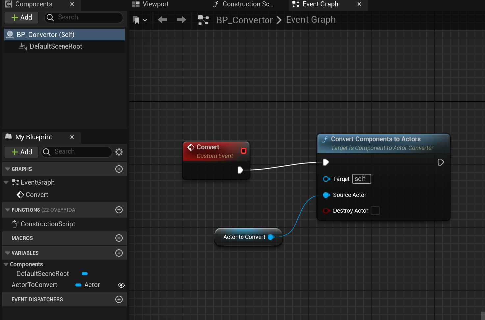
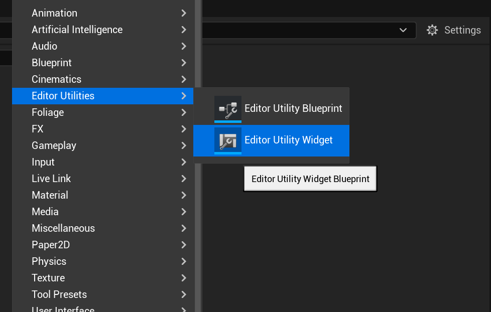
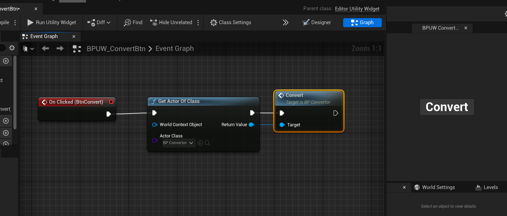

# Components to Actors Converter Plugin

This plugin converts components of an actor into separate actors, maintaining the hierarchy.

**Tested in UE 5.4 & 5.5**

Before using the plugin, you need to rebuild it since it does not include the Binaries and Intermediate folders.

## Usage Instructions

### Step 1: Create a Blueprint from the Plugin Class

- Create a new blueprint from the `ComponentToActorConverter` class provided by the plugin.

### Step 2: Set Up the Blueprint

- Set the actor you want to convert as a parameter in the blueprint.
- Create a custom event (e.g., `Convert`) and call the `ConvertComponentsToActors` function.
- Check the option to destroy the original actor if needed.

### Step 3: Create an Editor Utility Widget

- Create an Editor Utility Widget and add a button.
- On button click, call the `Convert` event from the blueprint.

